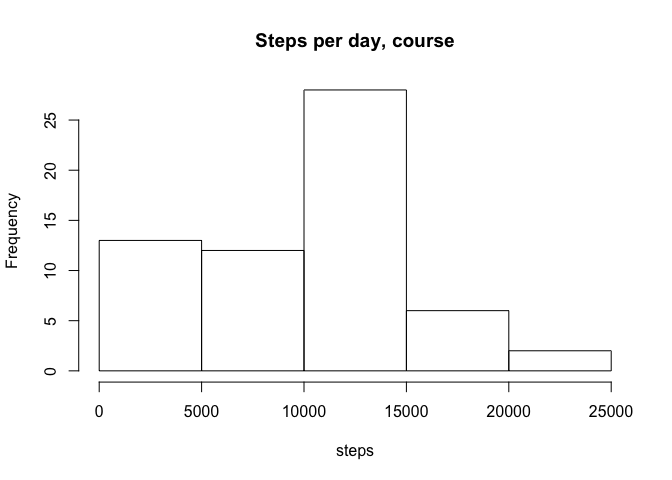

# Reproducible Research: Peer Assessment 1


## Loading and preprocessing the data
We will be utilizing some helper packages for this analysis:

```r
# install.packages("data.table")
library(data.table)
library(lattice)
```

We utilize caching to avoid bandwidth costs, if the fetch date file exists, it means we've 
previously downloaded and unzipped the source data file.
The data is loaded into a data.table, instead of data.frame, for easier access.


```r
dataLoc     <- "https://d396qusza40orc.cloudfront.net/repdata/data/activity.zip"
subdir      <- "data"
dataSrcFile <- "activity.zip"
dataSrc     <- "activity.csv"
dataSrcTime <- "fetchtime.rda"

if(!file.exists(subdir) ) {   ## dir.exists is an R 3.2.0 feature
    dir.create(subdir)
}
if(!file.exists(file.path(subdir,dataSrcTime))){
    download.file(method="curl", destfile=file.path(subdir,dataSrcFile), url=dataLoc)
    dataFetchDate <- Sys.time()
    unzip(file.path(subdir,dataSrcFile), exdir=subdir)
    save(dataFetchDate, file=file.path(subdir,dataSrcTime))
} else {
    load(file.path(subdir,dataSrcTime))
}

# We are using data.table instead of data.frame, so fread instead of read.csv
act <- fread(file.path(subdir,dataSrc))
```

The data file is sourced from https://d396qusza40orc.cloudfront.net/repdata/data/activity.zip, 
and was fetched on Wed Sep 16 17:49:04 2015. 


## What is mean total number of steps taken per day?
Our initial approach is to sum up the steps for each day, at this stage ignoring values not available.
There are 3 interesting questions to answer here:

1. Total number of steps taken each day
1. A Histogram of the steps
1. Mean and Median of the total number of steps.

### Total Steps by day

```r
countbyday <- sapply(split(act$steps,act$date),sum,na.rm=TRUE)
countbyday
```

```
## 2012-10-01 2012-10-02 2012-10-03 2012-10-04 2012-10-05 2012-10-06 
##          0        126      11352      12116      13294      15420 
## 2012-10-07 2012-10-08 2012-10-09 2012-10-10 2012-10-11 2012-10-12 
##      11015          0      12811       9900      10304      17382 
## 2012-10-13 2012-10-14 2012-10-15 2012-10-16 2012-10-17 2012-10-18 
##      12426      15098      10139      15084      13452      10056 
## 2012-10-19 2012-10-20 2012-10-21 2012-10-22 2012-10-23 2012-10-24 
##      11829      10395       8821      13460       8918       8355 
## 2012-10-25 2012-10-26 2012-10-27 2012-10-28 2012-10-29 2012-10-30 
##       2492       6778      10119      11458       5018       9819 
## 2012-10-31 2012-11-01 2012-11-02 2012-11-03 2012-11-04 2012-11-05 
##      15414          0      10600      10571          0      10439 
## 2012-11-06 2012-11-07 2012-11-08 2012-11-09 2012-11-10 2012-11-11 
##       8334      12883       3219          0          0      12608 
## 2012-11-12 2012-11-13 2012-11-14 2012-11-15 2012-11-16 2012-11-17 
##      10765       7336          0         41       5441      14339 
## 2012-11-18 2012-11-19 2012-11-20 2012-11-21 2012-11-22 2012-11-23 
##      15110       8841       4472      12787      20427      21194 
## 2012-11-24 2012-11-25 2012-11-26 2012-11-27 2012-11-28 2012-11-29 
##      14478      11834      11162      13646      10183       7047 
## 2012-11-30 
##          0
```

### Histogram of Steps by Day
A histogram is a good way to visually see the breakdown of the distribution of the data.

Two histograms are generated to show how a large quantity of an outliner can skew the graph. 

```r
hist(countbyday, main="Steps per day, course", xlab="steps")
```

 

```r
hist(countbyday, main="Steps per day, fine", xlab="steps", breaks=20)
```

 

### Mean/Median

```r
## normally this would have been inlined, but to show up in the .md we calculate here
day_mean <- mean(countbyday, na.rm=TRUE)     #`r mean(byday, na.rm=TRUE)`
day_median <- median(countbyday, na.rm=TRUE) #`r median(byday, na.rm=TRUE)`
```

The mean number of steps is 9354.2295082
and the median value is 10395.


## What is the average daily activity pattern?
Activity by time of day is a potential interesting analysis.

1. Time plot of the [5 minute] intervals vs the average number of steps taken
1. Which interval, on average across all the days in the dataset, contains the maximum number of steps?

### Time plot of interval vs average number of steps


```r
avgbyinterval <- sapply(split(act$steps,act$interval),mean,na.rm=TRUE)
intervals <- names(table(act$interval))
plot.ts(x=intervals, y=avgbyinterval, type="l", xlab="Intervals (hours)", ylab="# steps")
```

 


```r
# get the max value and determine which interval it was from
maxavgint <- intervals[which.max(avgbyinterval)]
```
The interval with the most average steps is 835, containing 206.1698113 steps.

## Imputing missing values

1. Calculate and report the total number of missing values in the dataset.
2. Devise a strategy for filling in all of the missing values in the dataset.
3. Create a new dataset that is equal to the original dataset but with filled in data.
4. Histograms of the filled data, with mean and median calculations. Compare the values to earlier. What is the impact?


```r
# Count the number of missing data rows
naCount <- sum(is.na(act$steps))

# for filling in the dataset we should should average
act_rle <- rle(is.na(act$steps))
na_rle <- split(act_rle$lengths, act_rle$values)$`TRUE`
na_runcount <- length(na_rle)
```

A strategy for filling in the data should take into account how the missing values are aggregated. 
If the missing values are spot drops mid stream we can average the surrounding values.  If there are
long runs, e.g. the device was off for extended periods of time, then a interval average strategy
may be more appropriate.

To test this, we can use a Run List Encoding on the NAs within the data set. There are 288 intervals
within a day (60 / 5 * 24).  Within the dataset there are 7 runs of NA, with the 
smallest run being 288 and the largest 576. This comprises a total of 
2304 missing values.

As a result, out best solution is to replace NAs with the integer conversion of the average for the interval.


```r
# data.table's need to be explicitly copied
act_filled <- data.table(act, key=NULL)
# loop assign and coerse as integer
for(x in 1:nrow(act_filled)) {
    int <- match(act_filled[x]$interval, intervals)
    if (is.na(act_filled[x,steps])) {
        act_filled[x, steps := as.integer(avgbyinterval[int])]
    }
}
```

These pair of histograms take into account filled ata
Two histograms are generated to show how a large quantity of an outliner can skew the graph. 

```r
filledcountbyday <- sapply(split(act_filled$steps,act_filled$date),sum,na.rm=TRUE)
hist(filledcountbyday, main="Steps per day, course", xlab="steps")
```

 

```r
hist(filledcountbyday, main="Steps per day, fine", xlab="steps", breaks=20)
```

 

```r
filledday_mean <- mean(filledcountbyday)
filledday_median <- median(filledcountbyday)
```

The mean number of steps is 1.074977\times 10^{4} (vs 9354.2295082)
and the median value is 10641 (vs 10395).

This slight uptick is a result of pushing up from zero'ed data. Further developement of models are
probably warrented here.

## Are there differences in activity patterns between weekdays and weekends?

1. Create a new factor variable with two levels -- "weekday" and "weekend" indicating whether a given day is a weekday or a weekend day.
2. Map a panel plot containing a time series plot of the 5 minute interval and average number of steps taken, averaged across all weekedays days or weekend days.


```r
# Generate a list of weekdays
act_days <- unname(sapply(act_filled$date, function(x) weekdays(strptime(x,format="%Y-%m-%d"))))
# Set values to "weekday" or "weekend"
# recode() from the library(car) package is nice, but requires R >= 3.2.0
#recode(act_days,"c('Monday','Tuesday', 'Wednesday', 'Thursday', 'Friday') = 'weekday';c('Saturday','Sunday') = 'weekend'")
act_days[act_days %in% c("Monday","Tuesday","Wednesday","Thursday","Friday")] <- "weekday"
act_days[act_days %in% c("Saturday","Sunday")] <- "weekend"
# Convert to factor
act_days <- factor(act_days, labels=c("weekday","weekend"))
# Add to table
act_filled$daytype <- act_days

dtype <- split(act_filled, act_filled$daytype)
dayavgbyinterval <- sapply(split(dtype$weekday$steps,dtype$weekday$interval),mean)
endavgbyinterval <- sapply(split(dtype$weekend$steps,dtype$weekend$interval),mean)

stepavgbytype <- data.table(interval=as.integer(intervals), steps=as.integer(c(endavgbyinterval,dayavgbyinterval)), daytype=c(rep("weekend", 288), rep("weekday", 288)))
stepavgbytype$daytype <- factor(stepavgbytype$daytype, levels=c("weekday","weekend"), labels=c("weekday","weekend"))
# Plot data
xyplot(steps ~ interval  | daytype, data=stepavgbytype, type="l", ylab="Number of steps", xlab="Interval", xlim = c(0,2300), ylim=c(0,250), layout=c(1,2))
```

 

The graphs show marked differences in both intensity and frequency of steps during the week.
A potential conclusion is that some normalized activity is performed in the mornings (such as 
waking to a coffee shop).
